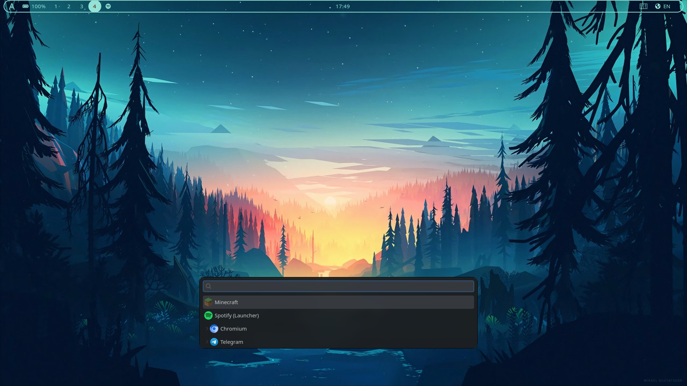

# My Hyprland configuration
A configuration that can help you to use Hyprland without long configurations. Just install, put these configs and use.<br>
Hyprland is a dynamic window manager based on wayland<br>
You can read Hyprland docs here: https://hyprland.org/
<br>

Preview:


## Why Hyprland?
For me: 
* It has a full documetaries for their configuration
* It has a live reloading config
* It is a **_dynamic_** window manager
* It has a beautiful effects
* It just is popular. You can find a lot of solves of troubles in Internet
* It works on wayland (I just believe it is better than xorg lol)

## Is there is some problems?
Suddenly, yes. I have a trouble with _nvidia-utils_ package problems...

## How to use config?
Just put config calalogs to /home/[name]/.config/
```bash
git clone https://github.com/PNGoose/MyHyprland
cd MyHyprland
cp hypr ~/.config
cp wofi ~/.config
```


## To basic work you need:
* swww, waypaper - wallpapers
* wofi - app launcher
* kitty - terminal app
* chromium - internet browser
* hyprshot - screenshoter


```bash
sudo pacman -S kitty hyprland chromium
yay -S wofi swww waypaper
```
---
### What can you use now:
* SUPER+Q - start terminal
* SUPER+SHIFT+Q - open waypaper
* SUPER+SHIFT+W - random image to wallpaper
* SUPER+E - start app launcher
* SUPER+C - stop app
* SUPER+Z - fullscreen
* SUPER+V - on/off floting
* SUPER+D - add window to special screen
* SUPER+SHIFT+D - open special screen

---
### My plans?:
* Clear up the configs
* Rewrite waybar and wofi configs
* script to fast create .desktop files
* Light music player
* File manager

---
_My great Thanks to Internet heroes that inspired me to create repository. 
So I dont remember your names, but You helped me to understand how it works_
